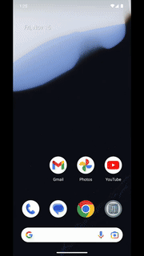

# Proyecto Android - Aplicación Kotlin Compose

Este proyecto fue desarrollado por **David Merchan** para la empresa **Apply Digital Latam**. Es una aplicación Android que muestra un listado de articulos de manera online y offline, utiliza **Kotlin** como lenguaje principal y **Jetpack Compose** con **Material 3** para el diseño de la interfaz de usuario. Se siguen los principios de diseño **SOLID**, **KISS** y **DRY** para garantizar un desarrollo eficiente, fácil mantenimiento y entendimiento del código.

## Características del Proyecto

1. **Pruebas**:
    - Se implementan pruebas unitarias utilizando la biblioteca **MockK**.
    - Se integra **Crashlytics** para capturar y rastrear errores en caso de fallos durante la ejecución de la aplicación.

2. **Arquitectura**:
    - El proyecto sigue el modelo de **Clean Architecture**, dividiendo el código en módulos por capas:
        - **Presentation**: Contiene la lógica de la interfaz de usuario.
        - **Domain**: Maneja la lógica de negocio y casos de uso.
        - **Data**: Administra el acceso a fuentes de datos remotas y locales.
        - **Database**: Responsable del manejo de la información local.
        - **Network**: Encargado de las llamadas a la API.
        - **Core**: Contiene componentes transversales utilizados en toda la aplicación.
        - **DI**: Centraliza la configuración para la inyección de dependencias.
    - Se implementan los patrones de diseño **MVVM** (Model-View-ViewModel) para el flujo de datos y **MVI** (Model-View-Intent) para la gestión de estados y eventos en la UI.

3. **Inyección de Dependencias**:
    - Se utiliza **Hilt** como herramienta para la inyección de dependencias, debido a su robustez y capacidad de proporcionar feedback de errores en tiempo de compilación.

4. **Manejo de Datos**:
    - Para las consultas a la API, se implementa **Retrofit**.
    - Los datos obtenidos de la API se almacenan en una base de datos local utilizando **Room**, permitiendo que los datos sean accesibles incluso en ausencia de conexión a internet.

## Detalles Técnicos

### Principios y Buenas Prácticas
- **SOLID**: Para garantizar un diseño modular, escalable y mantenible.
- **KISS**: Manteniendo el código simple y fácil de entender.
- **DRY**: Evitando la duplicación de lógica y asegurando la reutilización del código.

### Herramientas y Librerías
- **Kotlin**: Lenguaje principal.
- **Jetpack Compose**: Para construir una UI moderna y reactiva.
- **Material 3**: Para aplicar el diseño visual.
- **MockK**: Para pruebas unitarias.
- **Crashlytics**: Para el monitoreo de errores y fallos.
- **Retrofit**: Para llamadas a la API.
- **Room**: Para la gestión de datos locales.
- **Detekt**: Para el analisis de codigo estatico.
- **Github Actions**: Se implementa un sencillo CI con Github actions para corroborar la estabilidad del codigo cada que se sube un cambio al repositorio.

## Cómo Descargar el Proyecto y Abrirlo en Android Studio

Sigue estos pasos para clonar el proyecto desde GitHub y configurarlo en **Android Studio** para su correcto funcionamiento:

### 1. Clonar el Repositorio

1. Abre tu terminal o línea de comandos.
2. Ejecuta el siguiente comando para clonar el repositorio:

   ```bash
   git clone https://github.com/DavidMerchan93/ADTechnicalTest
   ```

3. Cambia al directorio del proyecto:

   ```bash
   cd ADTechnicalTest
   ```

### 2. Abrir el Proyecto en Android Studio

1. Abre **Android Studio**.
2. Haz clic en **File > Open** (o **Open Project** dependiendo de la versión).
3. Navega hasta el directorio donde clonaste el proyecto y selecciona la carpeta raíz del proyecto.
4. Haz clic en **OK** para abrirlo.

### 3. Configurar el SDK de Android

1. Asegúrate de que tienes instalado el **SDK de Android 34** para la versión `compileSdk`.

### 4. Sincronizar Gradle

1. Una vez que el proyecto se abra, Android Studio solicitará sincronizar Gradle. Haz clic en **Sync Now**.
2. Asegúrate de que todas las dependencias se descarguen correctamente.

### 5. Ejecutar el Proyecto

1. Conecta un dispositivo físico o inicia un emulador desde **AVD Manager**.
2. Haz clic en el botón **Run** (o presiona `Shift + F10`) para compilar y ejecutar el proyecto.

## Imágenes

<p align="center">
  
  
  
  
  
  
</p>
